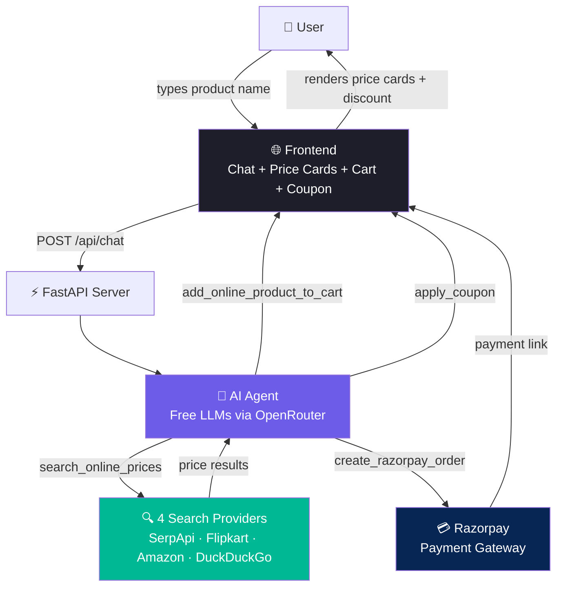

# MerchantAgent — AI-Powered Price Comparison & Checkout

> Online shoppers waste hours jumping between Amazon, Flipkart, and other sites to find the cheapest price. MerchantAgent solves this — you type what you want, it searches across multiple platforms, shows you the cheapest options, and lets you pay via Razorpay, all in one chat.

## How It Works

```
You: "Find cheapest iPhone 15"
Agent: [search_online_prices] → queries Amazon, Flipkart, Google Shopping
Agent: "Found 6 results! Cheapest is ₹54,900 on Smartprix"
You: *clicks "+ Cart" button*
Agent: [add_online_product_to_cart] → added to cart
You: *enters coupon SAVE10, clicks Apply*
Agent: [apply_coupon] → 10% discount applied
You: *clicks "Pay with Razorpay"*
Agent: [create_razorpay_order] → payment link generated
```

## Architecture



## Features

| Feature | What It Does |
|---------|-------------|
| **Multi-Platform Search** | Searches Amazon, Flipkart, Google Shopping simultaneously |
| **Price Comparison** | Results sorted cheapest first with source badges (Amazon/Flipkart/etc.) |
| **"+ Cart" Button** | Click to add any search result directly to your cart |
| **Coupon System** | Enter coupon code → discount applied to cart total (SAVE10, FLAT20, etc.) |
| **Discount Display** | Cart shows ~~original price~~ → discount amount → final total |
| **Razorpay Checkout** | Direct checkout — click "Pay with Razorpay" and payment link is generated |
| **No Confirmation Flow** | Actions execute immediately — no "type confirm" or "would you like to proceed?" |
| **Quick Search Chips** | One-click buttons for trending products, electronics, fashion, deals |
| **Category Navigation** | Top nav with Trending, Electronics, Fashion, Home, Best Deals |
| **Audit Trail** | Every tool call logged with explanation, timestamp, and status |
| **Free LLMs** | Uses OpenRouter free model fallback chain (zero API cost) |
| **Async Search** | All 4 providers queried concurrently with timeout handling |

## Tech Stack

| Component | Technology |
|-----------|-----------|
| Backend | Python 3.11+, FastAPI, SQLAlchemy |
| LLM | OpenRouter free models (Inkling, Dots3, Nemotron) via OpenAI SDK |
| Payments | Razorpay Python SDK (test mode) |
| Database | SQLite (products, cart, orders, coupons, audit) |
| Search | SerpApi (Google Shopping), RapidAPI (Flipkart/Amazon), DuckDuckGo |
| Frontend | Vanilla HTML/CSS/JS + Three.js (3D animated logo) |
| Tests | pytest + pytest-asyncio (26 tests) |
| Deployment | Docker + Railway |

## Project Structure

```
merchant-agent/
├── backend/
│   ├── main.py                  # FastAPI app, endpoints, lifespan
│   ├── agent.py                 # LLM tool-calling orchestration (13 tools)
│   ├── tools.py                 # Validated tool functions + guardrails
│   ├── models.py                # SQLAlchemy ORM (7 tables)
│   ├── audit.py                 # Audit trail logging
│   ├── razorpay_client.py       # Razorpay SDK wrapper
│   ├── seed.py                  # 60 demo products + 5 coupons
│   └── search_providers/        # Multi-platform price comparison
│       ├── base.py              # Abstract base + SearchResult model
│       ├── serpapi_provider.py  # Google Shopping via SerpApi
│       ├── flipkart_provider.py # Flipkart via RapidAPI
│       ├── amazon_provider.py   # Amazon via RapidAPI
│       ├── duckduckgo_provider.py # Free fallback (no API key)
│       └── aggregator.py        # Concurrent search + dedup + sort
├── frontend/
│   └── index.html               # Chat + price cards + cart + coupon + nav
├── tests/
│   └── test_all.py              # 26 tests
├── Dockerfile                   # Railway deployment
├── railway.json                 # Railway config
├── requirements.txt
└── README.md
```

## Setup

### 1. Clone and install

```bash
git clone https://github.com/YOUR_USERNAME/merchant-agent.git
cd merchant-agent
python -m venv .venv
source .venv/bin/activate  # Windows: .venv\Scripts\activate
pip install -r requirements.txt
pip install pytest pytest-asyncio  # for tests
```

### 2. Configure API keys

```bash
cp .env.example .env
```

Edit `.env`:

```env
# OpenRouter (free LLMs)
OPENROUTER_API_KEY=sk-or-...

# Razorpay test mode
RAZORPAY_KEY_ID=rzp_test_...
RAZORPAY_KEY_SECRET=...

# Price comparison (at least one recommended)
SERPAPI_KEY=...              # serpapi.com (5,000 free/mo, covers Amazon+Flipkart)
RAPIDAPI_KEY=...             # rapidapi.com (free tier for direct Flipkart/Amazon)
```

### 3. Run

```bash
python -m backend.main
# Open http://127.0.0.1:8000
```

### 4. Run tests

```bash
python -m pytest tests/ -v
```

## API Endpoints

| Method | Path | Description |
|--------|------|-------------|
| `POST` | `/api/chat` | Send message → agent reply + tool actions + cart |
| `GET` | `/api/products` | List local products |
| `GET` | `/api/audit/{session_id}` | Audit trail for a session |
| `GET` | `/api/orders/{session_id}` | Orders for a session |
| `POST` | `/webhook/razorpay` | Razorpay webhook receiver |
| `GET` | `/health` | Liveness check |
| `GET` | `/` | Frontend UI |
| `GET` | `/docs` | Auto-generated API docs |

## Available Coupons

| Code | Discount | Max Uses |
|------|----------|----------|
| `SAVE10` | 10% off | 100 |
| `FLAT20` | 20% off | 50 |
| `WELCOME15` | 15% off | 200 |
| `MEGA25` | 25% off | 30 |
| `FIRST50` | 50% off | 10 |

## Deployment

### Railway (recommended)

1. Push to GitHub
2. Connect repo to [railway.app](https://railway.app)
3. Set environment variables in Railway dashboard
4. Railway auto-deploys via Dockerfile

### Docker

```bash
docker build -t merchant-agent .
docker run -p 8000:8000 --env-file .env merchant-agent
```

## Test Results

```
26 passed in 3.33s

tests/test_all.py::TestSearchResult::test_price_display_inr         PASSED
tests/test_all.py::TestSearchResult::test_price_display_usd         PASSED
tests/test_all.py::TestDuckDuckGoProvider::test_search_returns_list PASSED
tests/test_all.py::TestDuckDuckGoProvider::test_price_extraction    PASSED
tests/test_all.py::TestAggregator::test_deduplication               PASSED
tests/test_all.py::TestTools::test_add_online_product_to_cart       PASSED
tests/test_all.py::TestTools::test_apply_coupon_invalid             PASSED
tests/test_all.py::TestAPI::test_health                             PASSED
tests/test_all.py::TestAPI::test_products                           PASSED
tests/test_all.py::TestAPI::test_frontend_serves                    PASSED
... (26 total)
```

## License

MIT
